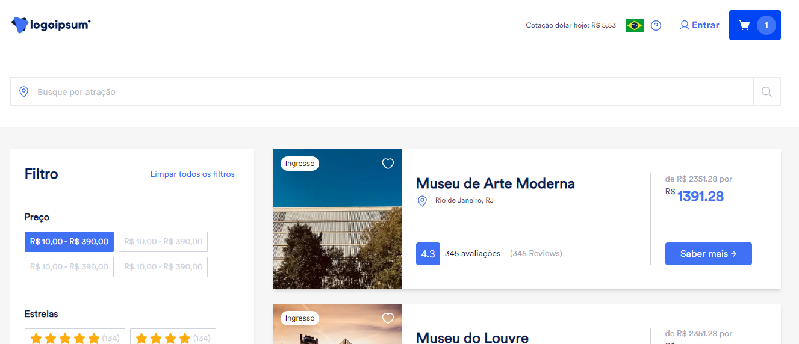

<h2 align="center">Just travel | Front end | Back end</h1>

  <p align="center" id="menu">
    <a href="#sobre-o-projeto">Sobre o projeto</a>
    <a href="#stacks-utilizadas">Stacks utilizadas</a>
    <a href="#instalação-e-execução-local">Instalação e execução local</a>
    <a href="#documentação">Documentação</a>
  </p>

  <h2 align="center" id="sobre-o-projeto">Sobre o projeto</h2>

  <p align="center">
    projeto para compra de ingressos online

      <a href="https://just-travel-tau.vercel.app/">deploy</a>
  <p>

  

  <h2 align="center" id="stacks-utilizadas">Stacks utilizadas</h2>
<p align="center">
  <a href="https://skillicons.dev">
    
  </a>
</p>

  <h2 id="instalação-e-execução-local" align="center"> Instalação e execução local </h2>

  <p>
Para instalar o aplicativo, siga as instruções:
  </p>
  
  
```
npm i
npm run dev
```

<p>
O aplicativo estará disponível em http://localhost:3000/
</p>


<h2 id="documentação" align="center"> Storybook </h2>
<p>
   A documentação de todos os componentes do aplicativo foi feita com o Storybook. Você pode acessá-la através deste link: <a href="https://65cbede3c9638330bc52e843--dreamy-shortbread-14a8ff.netlify.app/?path=/docs/just-travel-storybook--docs">Storybook</a>
</p>

<p>
Ou pode Execultar localmente
</p>

```
npm run storybook
```
<p>
O aplicativo estará disponível em http://localhost:6006/
</p>

<h2 id="documentação" align="center"> Testes Unitários </h2>

<p>
  Foram utilizados testes unitários com a biblioteca Vitest, abrangendo desde funções básicas de renderização condicional até funções mais complexas, como aquelas relacionadas à manipulação do carrinho. O objetivo foi alcançar a melhor cobertura possível durante os testes.
</p>

<p>
  Para executar os testes, utilize os comandos abaixo:
</p>

```
npm run test
// ou
npm run test:ui
```


<h2 align="center">Contato e redes sociais</h2>

```
